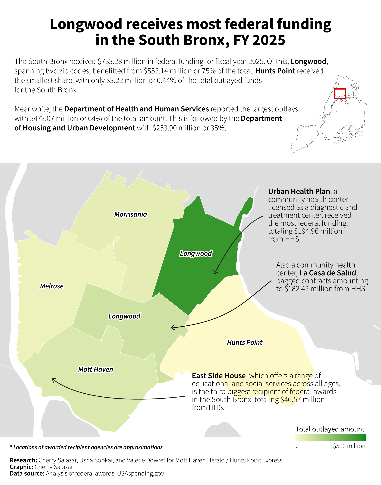

# NYC federal funding, FY 2025

This repository holds preliminary budget reports from the [New York City Council website](https://council.nyc.gov/budget/fy2025/) and federal awards data for [USAspending.gov](https://www.usaspending.gov/search/?hash=966f5f0446cbe09c05fb1d16dee2885a&section=map). 

The data will be analyzed and used for a reporting assignment for the [Mott Haven Herald](https://motthavenherald.com/) and [Hunts Point Express](https://huntspointexpress.com/), to be produced with Usha Sookai and Valerie Dowret.

## Content and process

### `pdfs`

The folder contains PDF files of NY City Council preliminary budget reports scraped and downloaded via `BeautifulSoup` and `requests`. 

See `scraper.ipnyb` and `downloader.ipynb` for the process. 

The files were manually reviewed. Data about the total agency budget and amount of federal funding per agency were manually encoded.

### `usaspending`

The folder contains downloaded federal awards data from USAspending.gov. 

See `federal-awards-analysis.ipynb` for the methodology.